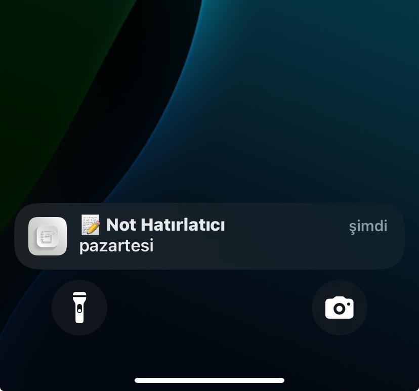
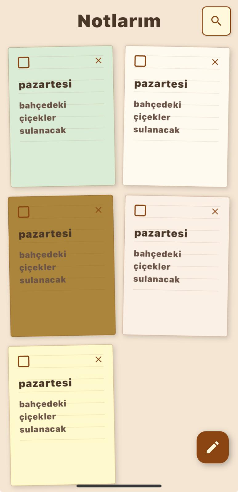
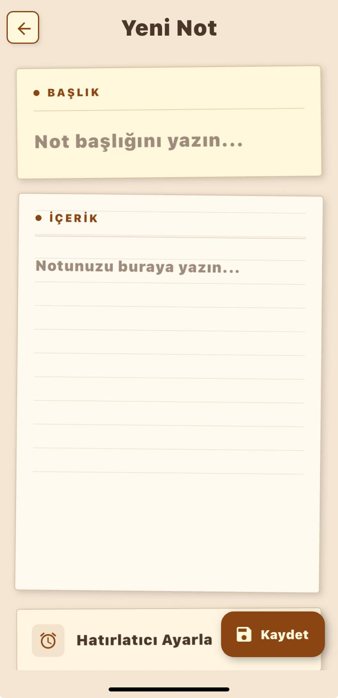

## Vintage Note

Vintage Note, Flutter ile geliştirilmiş, yüksek performanslı ve bulut senkronizasyonlu bir not alma uygulamasıdır. Kullanıcıların internet olmasa dahi notlarını yönetebilmesini sağlayan Offline-First mimarisi ile tasarlanmıştır.

## Teknik Mimari
Uygulama, verimlilik ve veri tutarlılığını sağlamak için hibrit bir veritabanı yapısı ve asenkron senkronizasyon algoritmaları kullanır:

- **Frontend:** Flutter & Dart

- **State Management:** Provider

- **Local Database:** Isar NoSQL 

- **Backend:** Flask (Python)

- **Cloud Database:** MongoDB Atlas

- **Notifications:** Awesome Notifications (Hatırlatıcı sistemleri)

- **API Client:** http.Client

## Uygulama Görselleri

<div style="display: grid; grid-template-columns: repeat(auto-fit, minmax(200px, 1fr)); gap: 15px; padding: 10px;">
  
  
  

</div>


## Kurulum ve Çalıştırma

1. **Repoyu klonlayın:**
   ```bash
   git clone [https://github.com/asmss/notes_project_0.git](https://github.com/asmss/notes_project_0.git)
Proje dizinine gidin:
cd notes_project_0/notes

Bağımlılıkları yükleyin:
flutter pub get

Isar kod oluşturucuyu çalıştırın:
dart run build_runner build --delete-conflicting-outputs

Uygulamayı çalıştırın:
flutter run

---


